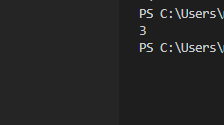

you will be given an array of integers whose elements have both a negative and a positive value, except for one integer that is either only negative or only positive. Your task will be to find that integer.It sould work for big arrays as well

Examples: [1, -1, 2, -2, 3] => 3

3 has no matching negative appearance

